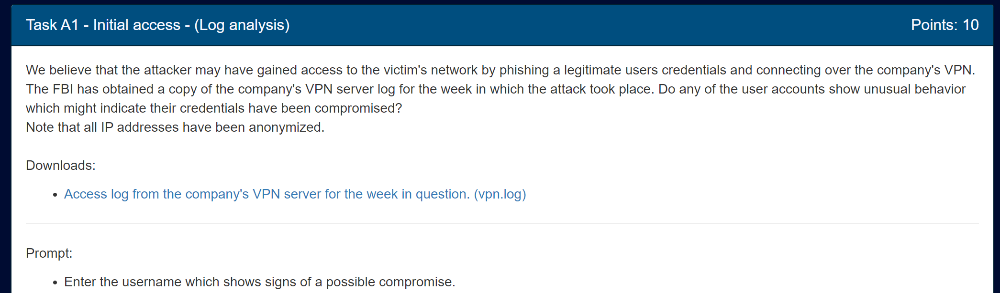
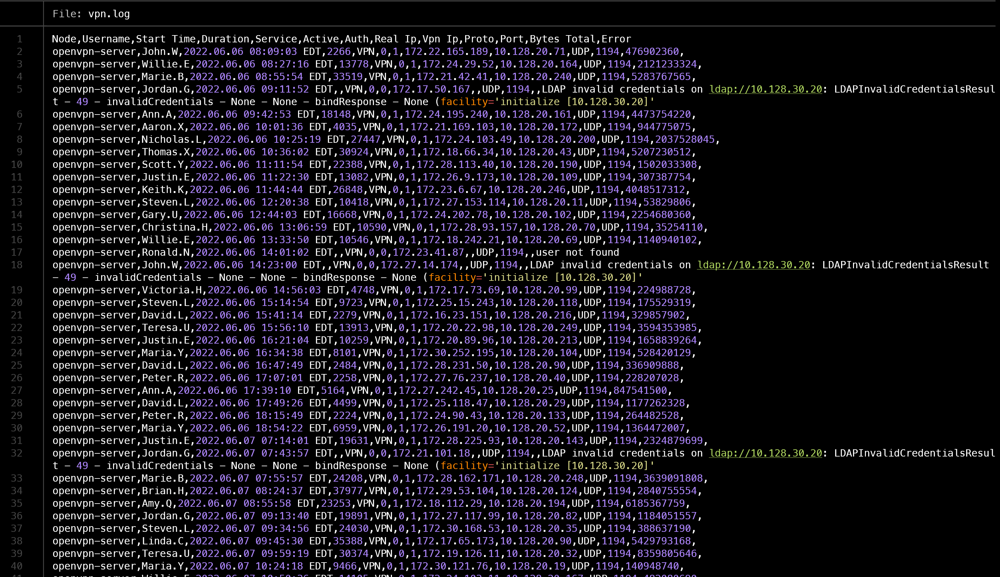
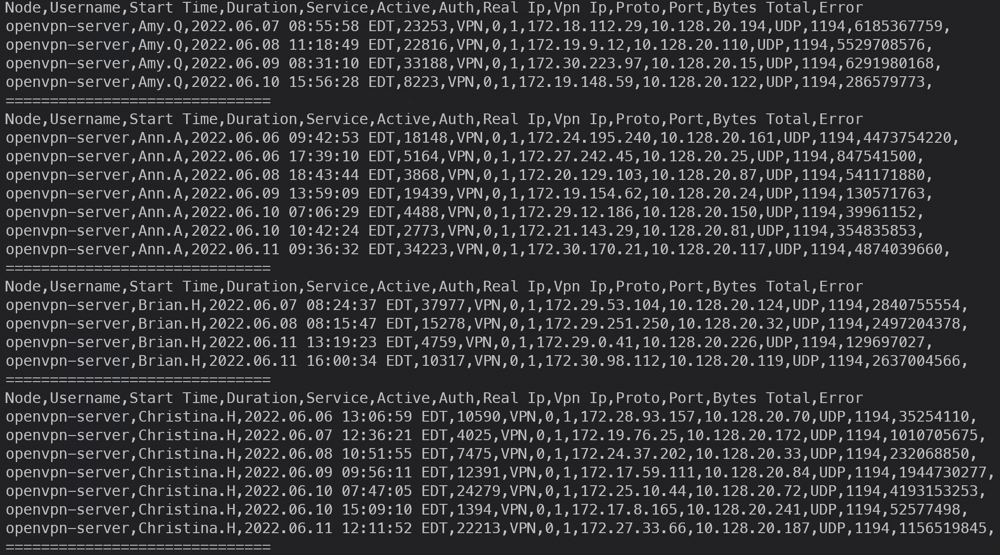
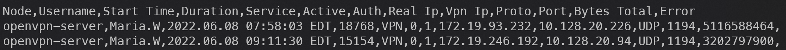
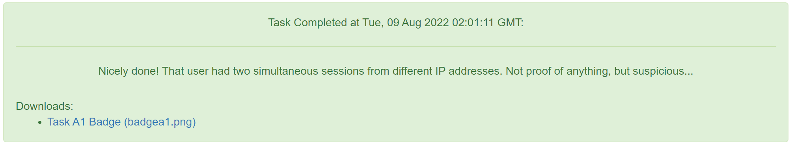
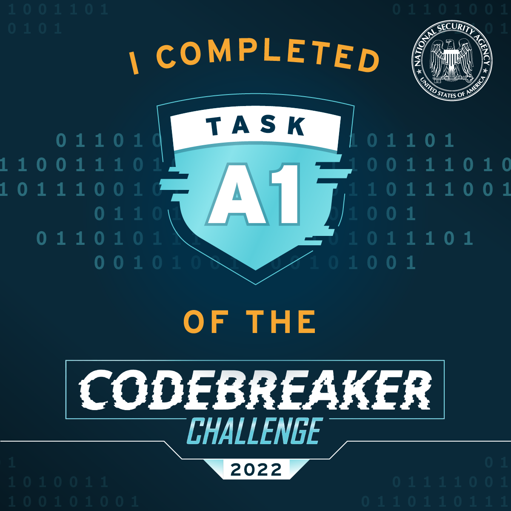

# Task A1

Prompt:


Files:

- [Access log from the company's VPN server for the week in question. (vpn.log)](../orig_files/a1/vpn.log)

We get a vpn logfile to look through:



From the prompt, we know that the credentials used to log in were phished. There are many ways for this to be displayed: unusual login times, abnormal number of bytes transferred in the session, etc

The only *surefire* way to show someone else has your credentials, however, is to have two people logged in simultaneously. The logfile is sorted by vpn time, so this would be hard to find just looking at the file. I wrote a quick python script to sort the vpn logs by the user's name so we can see each person's sessions easier.

Here's the script:
```py
for name in open("./usernames.txt", "r"):
    name = name.strip()
    for line in open("./vpn.log", "r"):
        line = line.strip()
        if "Node," in line:
            print(line)
            continue
        if name in line:
            print(line)
            
    print("="*30)
```
This prints the output to the terminal and I manually looked for overlapping sessions. Here's a snippet what the output looks like:



Scrolling through these, I looked at the `Time` and `Duration` columns to establish an end time for each session. If the user's next session starts *before* the previous session's end time, that shows two sessions logged in at once, which is abnormal for the normal user.

After looking for this pattern, there was only one user that had overlapping sessions:



We can submit this user as the one who had their credentials phished and move on to the next task!

Flag: `Maria.W`


<!--  -->