# Task A2

Prompt:
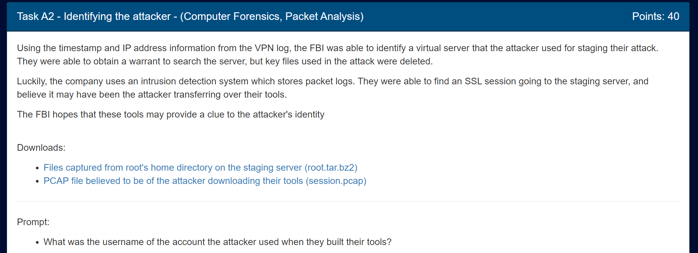

Files:

- [Files captured from root's home directory on the staging server (root.tar.bz2)](../orig_files/a2/root.tar.bz2)
- [PCAP file believed to be of the attacker downloading their tools (session.pcap)](../orig_files/a2/session.pcap)

For this task, we're given the user's root directory with their files and a TLS encrypted pcap. We can decrypt the pcap if we can find the certificate in Maria's directory.

An initial look at the folder shows a python script:
```py
#!/usr/bin/env python3

# This script will create an anonymous, secure, temporary web server to transfer files over HTTPS.

import argparse
import datetime
import os
import random
import string
import subprocess
import sys

try:
    import libfaketime
except ImportError:
    subprocess.run(f'{sys.executable} -m pip install --user libfaketime', shell=True)
    import libfaketime


p = argparse.ArgumentParser()
p.add_argument('port', type=int)
args = p.parse_args()

certfile = '.cert.pem'
randoff = datetime.timedelta(seconds=random.randrange(3 * 365 * 24 * 3600))
dt = datetime.datetime.strptime('2017-01-01 00:00:00', '%Y-%m-%d %H:%M:%S') + randoff
env = libfaketime.get_reload_information()[1]
env['FAKETIME'] = dt.strftime('%Y-%m-%d %H:%M:%S')
cn = ''.join(c for c in random.choices(string.ascii_lowercase, k=12))
subprocess.run(
    f'openssl req -x509 -out {certfile} -new -keyout {certfile} -newkey rsa:4096 -batch -nodes -subj /CN={cn} -days 3650',
    env=env,
    stderr=subprocess.DEVNULL,
    check=True,
    shell=True)
subprocess.run(f'openssl x509 -noout -text -in {certfile}', shell=True)
print(f'Running openssl HTTPS server on port {args.port}')
os.execlp('openssl', 'openssl', 's_server', '-accept', str(args.port), '-cert', certfile, '-tls1_2', '-cipher', 'AES256-GCM-SHA384', '-WWW')
```

Very interesting. It uses HTTPS, so we can expect TLS-encrypted traffic. It also refererences the certificate `.cert.pem` that is used to encrypt the traffic. Since it directly references the filename, it seems to be in the same directory. The dot before it means that the file is hidden from normal directory listings.

If we list the files in the root directory (including the hidden ones) using `ls -a`, we see this:


There's the certificate! Now we can open up the pcap using wireshark and add the certificate to decrypt the traffic.

---

## Decrypting TLS traffic

Opening the pcap in wireshark, we get encrypted traffic as predicted:

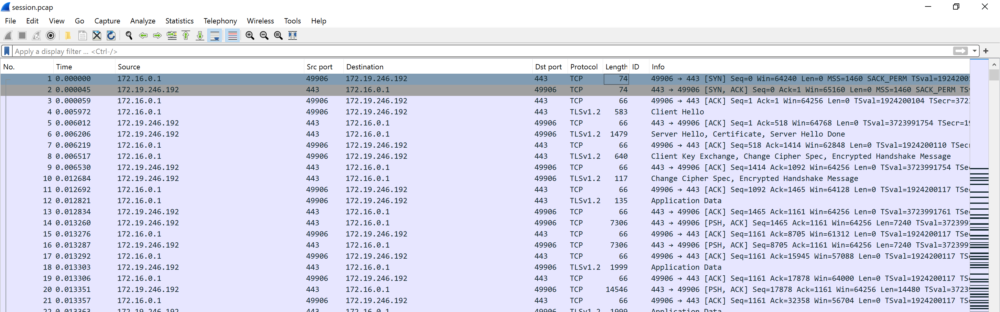

To add the certificate to decrypt it, you go to `Edit->Preferences->Protocols->TLS`, Edit the RSA keys list, and add the `.cert.pem` key file.

Now we can see an HTTP GET request unencrypted:

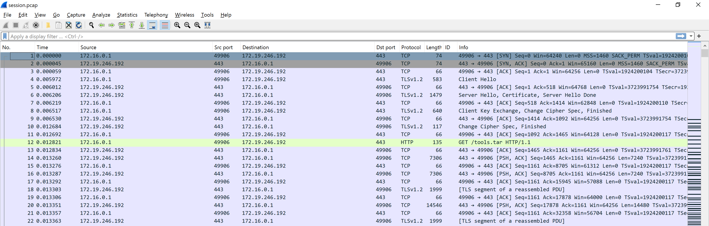

Looks like our attackers are downloading `tools.tar`... that can't be good. Let's take a closer look at those tools.

Unfortunately, the normal method (`File->Export Objects`) used to extract files from a pcap doesn't seem to be working, so lets try to do this manually.

---

## File extraction

We can follow the TLS stream from the revealed HTTP request and look at the data sent in this stream:

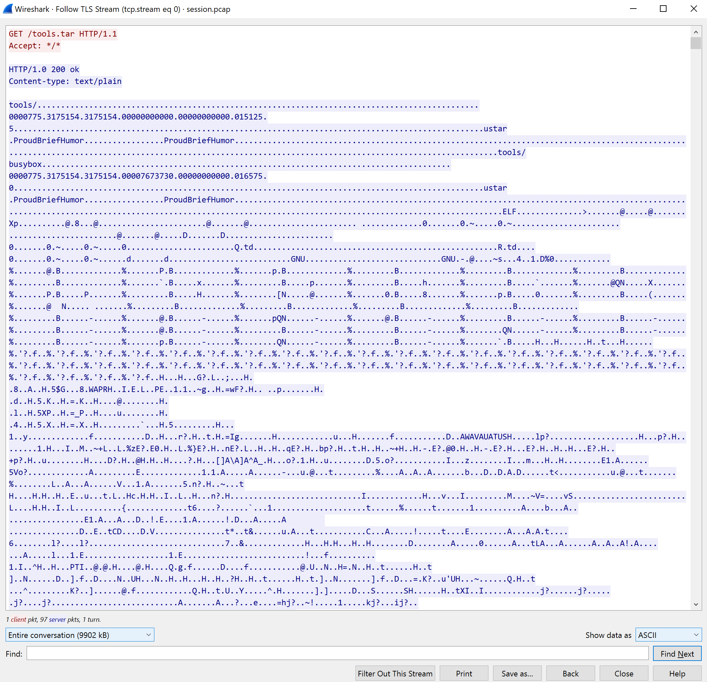

We can now just focus on the data sent back to us by modifying the value in the bottom left:

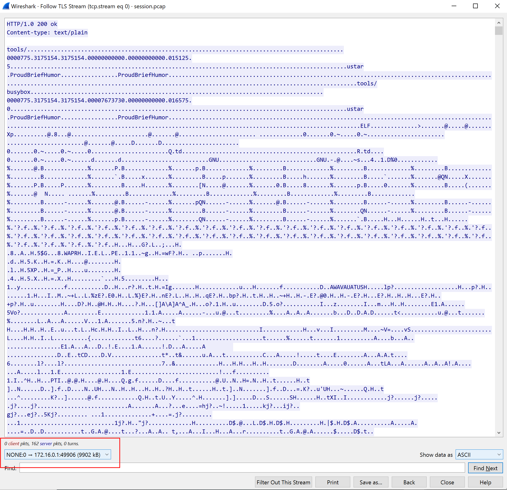

Now, lets turn this data into the raw hex bytes:

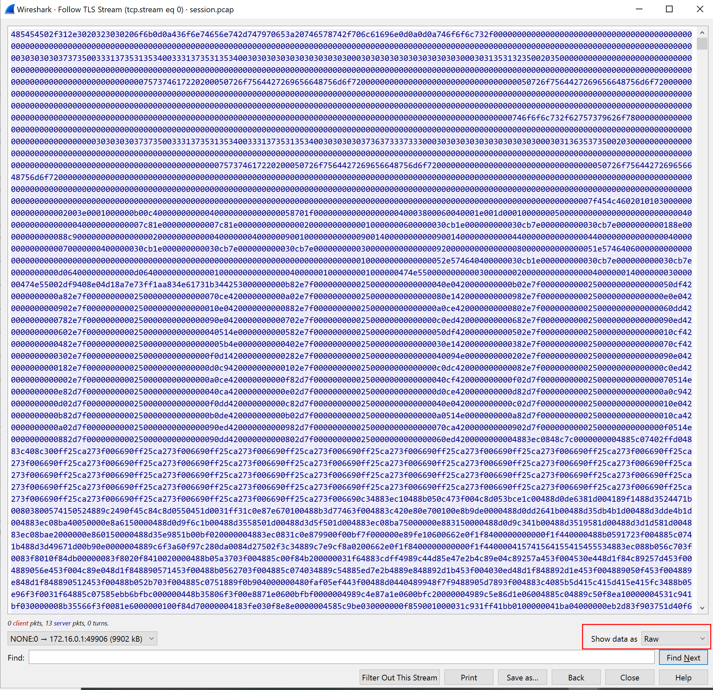

We can save this to a file on our local system now by using the `Save As` button at the bottom.

Lets edit this and remove those first two lines from the HTTP request. I just opened it up in `vim` and deleted the lines as well as the trailing newline character. 

Note: If you also use `vim`, make sure to not give the file the `.tar` extension immediately since `vim` will try to read it in a different way.

Before:
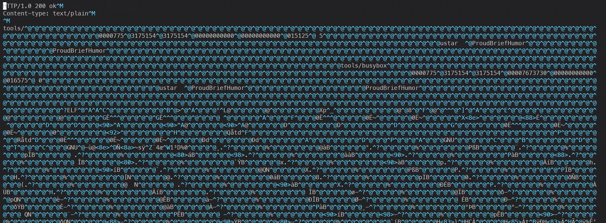

After:
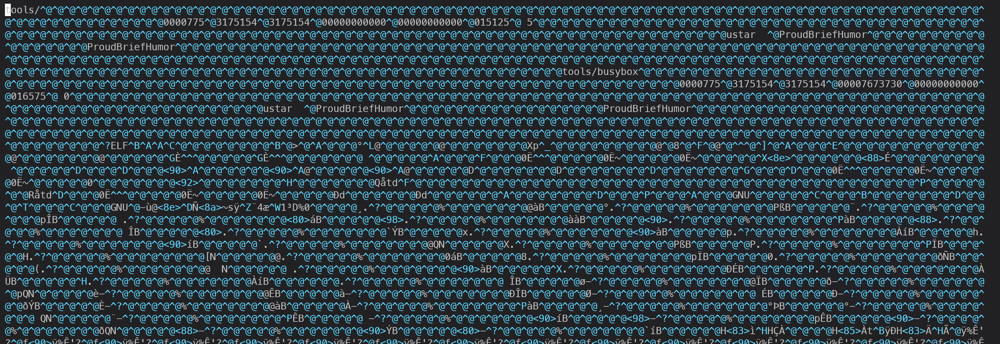

Now if we try to run file on it, it shows up as a POSIX tar archive. Perfect!

---

## File analysis

Once we have the tar archive, we now have to figure out the original owner. Trying the normal method of `tar xvf tools.tar`, looks like I became the owner and it wasn't preserved:

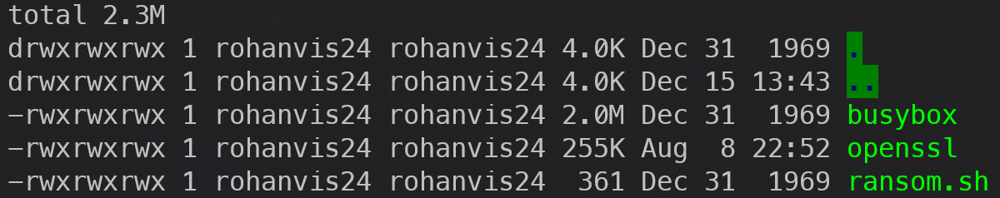

If you less the tar file (`less tools.tar`), you can actually see some strings within that show directory information:

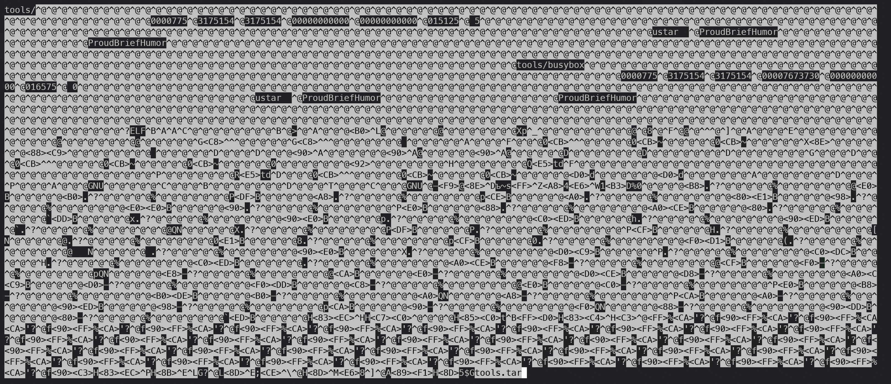

I also found that if we change the extraction command to be verbose (`tar xvf tools.tar -v`), we get to see the original filesystem that was compressed:

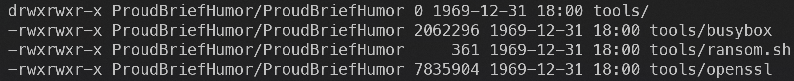

Both methods seem to show that the original owner of these files is ProudBriefHumor, so we can submit it and move on!

Flag: `ProudBriefHumor`
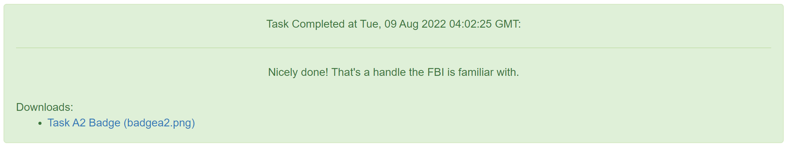