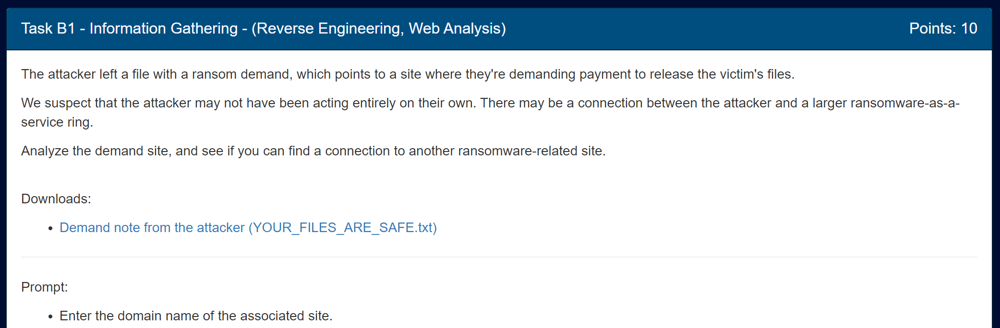
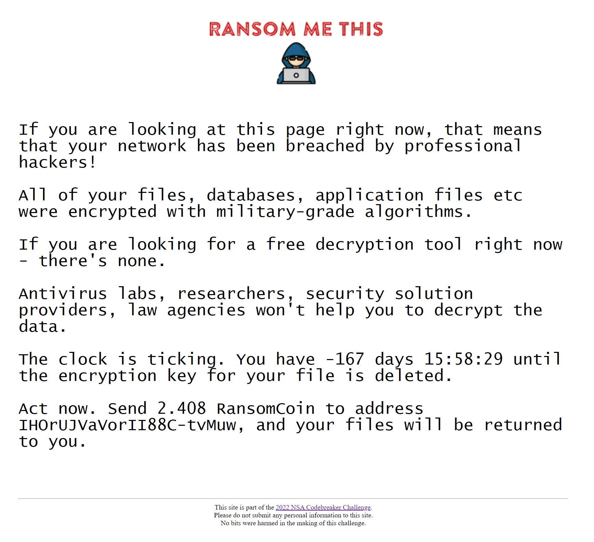
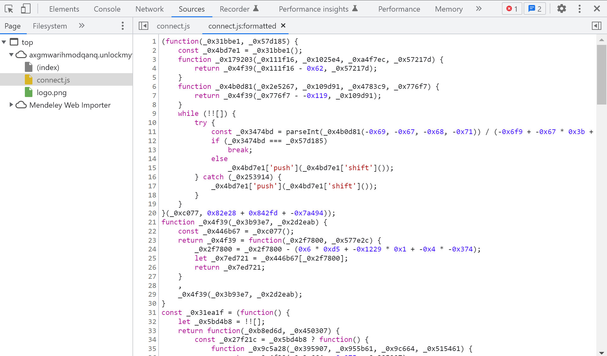
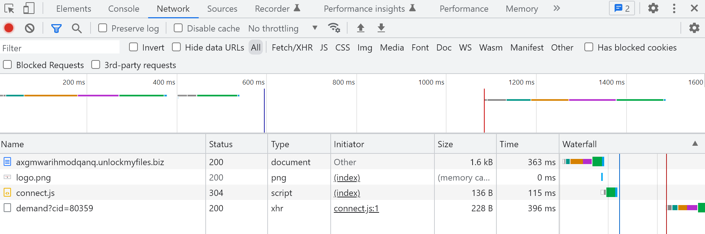
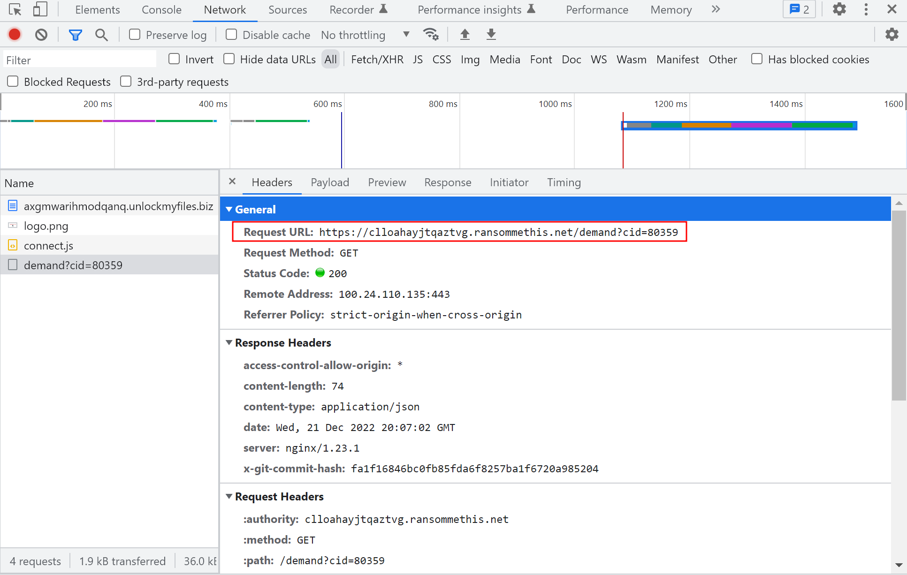
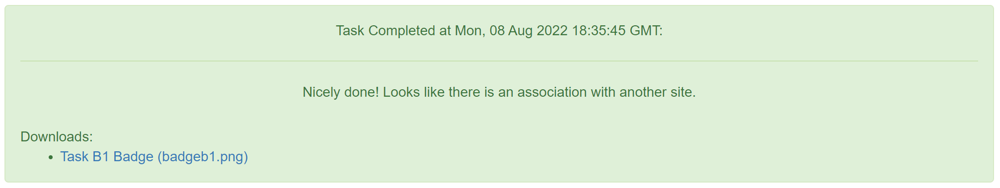

# Task B1

Prompt:


Files:

- [Demand note from the attacker (YOUR_FILES_ARE_SAFE.txt)](../orig_files/b1/YOUR_FILES_ARE_SAFE.txt)

Alright, so we're given a note from the attacker that says:
```
Your system has been breached by professional hackers.  Your files have been encrypted, but they are safe.
Visit https://axgmwarihmodqanq.unlockmyfiles.biz/ to find out how to recover them.
```

Interesting. Upon going to the website, we're met with this:



Sounds scary. Unfortunately, I'm broke and can't afford that, so let's look for anything that can help.

When I open dev tools and look at the sources, there's a suspicious file called `connect.js` that shows some obfuscated javascript:



The filename implies that some form of conection is happening. Maybe it shows up in the Network tab 🤔

Going over to the Network tab in dev tools and refreshing the page, we see this:



The first 3 requests are for the current page, but the last one is suspicious. There's no mention of that anywhere in the source code. Taking a closer look, we see that the request was made to a completely different website!



The task asked for the domain name of another ransomware site that was connected to. This site seems to fit the bill, so we can submit the domain and move on!

Flag: `clloahayjtqaztvg.ransommethis.net`
