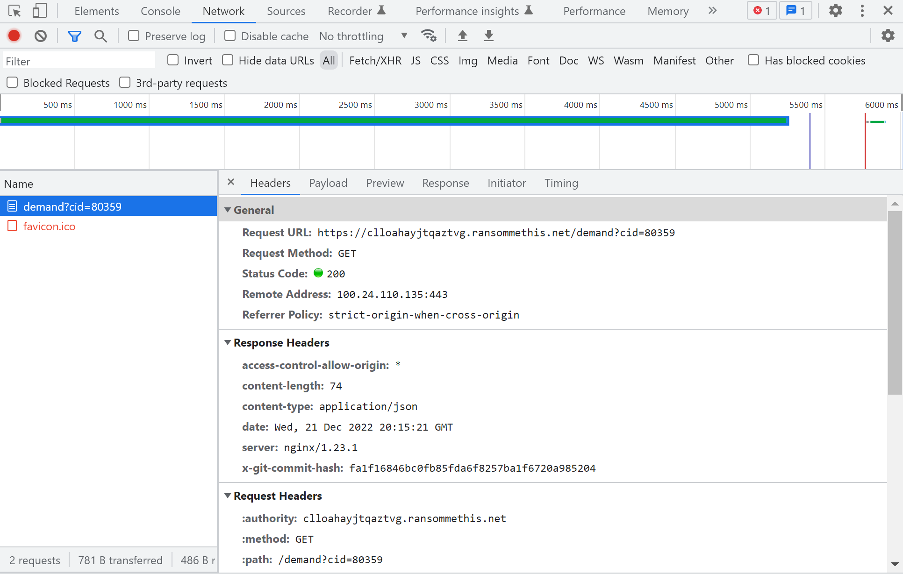

# Task B2

Prompt:


For this challenge, we had to take a deeper look into the newly-found ransomware site. As most web challenges begin, we open up dev tools and take a look around. There's nothing special in the sources tab this time, which is unfortunate. Looking at the network tab, however, shows us something weird:



There's a header called `x-git-commit-hash`... I've never seen that header before, so I did some research. The "X" in front of it *typically* means that it is a custom header. I couldn't find much on that specific header online other than it means a git repository is in play.

Webservers are usually run from a filesystem and have a `.git` directory if the files are part of a repo, so I tried to access the `.git` subdirectory:


Progress! Okay, so now we know that the `.git` directory exists. Maybe we can read individual files from it. It turns out we can download individual files that exist within the .git directory by accessing them directly. For example, I was able to download the config file by querying it through `https://clloahayjtqaztvg.ransommethis.net/.git/config`. Surely there's a way to automate this.

Turns out there's a handy tool called `git-dumper` that exists. It pulls all the files from a git repository down.

We can run:

`git-dumper https://clloahayjtqaztvg.ransommethis.net/.git <output directory>` 

and get all of the files within the repo:


Now we have access to all of the site's source code!

We can now try to figure out what the login page URL is. From this code snippet from `server.py`, we can see some routing:
```py
147   │ @app.route("/", defaults={'pathkey': '', 'path': ''}, methods=['GET', 'POST'])
148   │ @app.route("/<path:pathkey>", defaults={'path': ''}, methods=['GET', 'POST'])
149   │ @app.route("/<path:pathkey>/<path:path>", methods=['GET', 'POST'])
150   │ def pathkey_route(pathkey, path):
151   │     if pathkey.endswith('/'):
152   │         # Deal with weird normalization
153   │         pathkey = pathkey[:-1]
154   │         path = '/' + path
155   │
156   │     # Super secret path that no one will ever guess!
157   │     if pathkey != expected_pathkey():
158   │         return render_template('unauthorized.html'), 403
159   │     # Allow access to the login page, even if they're not logged in
160   │     if path == 'login':
161   │         return loginpage()
```

So we know there's a pathkey that needs to be prepended. The login page route after is just `login`, which is convenient.

At the start of `server.py`, we can see what `expected_pathkey()` returns:
```py
16   │ app = Flask(__name__)
17   │ Bootstrap(app)
18   │
19   │ def expected_pathkey():
20   │     return "mhqtyrypxgtseywu"
21   │
22   │ def forum():
23   │     return render_template('forum.html')
```

From these code snippets, it looks as if the login page's path should be `/mhqtyrypxgtseywu/login`. We can check this on the live website:


Awesome, we found it! We can submit it as the flag and move on!

Flag: `https://clloahayjtqaztvg.ransommethis.net/mhqtyrypxgtseywu/login`
