# Task 8

Prompt:
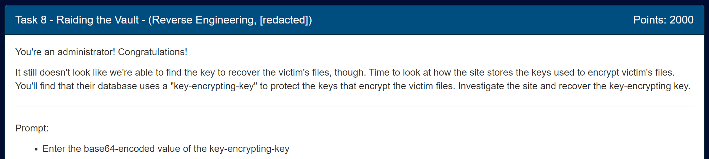

First, we should look around the admin panel. 

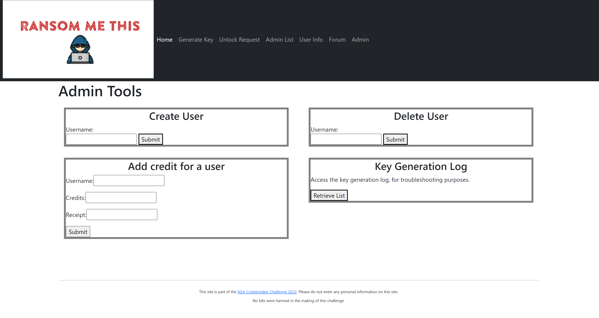

There's a key generation log button where we can download a list of all the keys that were generated (h m m 🤔). If we look at the website's source code, we can see how it is retrieving the log file:
```py
@app.route("/", defaults={'pathkey': '', 'path': ''}, methods=['GET', 'POST'])
@app.route("/<path:pathkey>", defaults={'path': ''}, methods=['GET', 'POST'])
@app.route("/<path:pathkey>/<path:path>", methods=['GET', 'POST'])
def pathkey_route(pathkey, path):
	if pathkey.endswith('/'):
		# Deal with weird normalization
		pathkey = pathkey[:-1]
		path = '/' + path
	# Super secret path that no one will ever guess!
	if pathkey != expected_pathkey():
		return render_template('unauthorized.html'), 403
	...	
	elif path == 'fetchlog':
		return util.check_admin(fetchlog)
	...
def fetchlog():
	log = request.args.get('log')
	return send_file("/opt/ransommethis/log/" + log)
```

So if we send a GET request to `/mhqtyrypxgtseywu/fetchlog` with our desired file as the `log` GET parameter, we can download the file. What happens if we add `../` to the file path? Maybe we can access other files hidden on the website... 🤔

Looking at the source code again, we can see there are other files on the website: `/opt/keyMaster/keyMaster`, `/opt/ransommethis/db/victims.db` and `/opt/ransommethis/db/user.db`. We can access all of these using the LFI exploit (https://clloahayjtqaztvg.ransommethis.net/mhqtyrypxgtseywu/fetchlog?log=../../keyMaster/keyMaster) so we can examine them more closely. The most interesting file out of these is the `keyMaster` binary, so let's reverse engineer that one first.

---

## Reversing

Decompiling this into Ghidra, it looks like a total mess. There's no symbols or anything, which doesn't help:
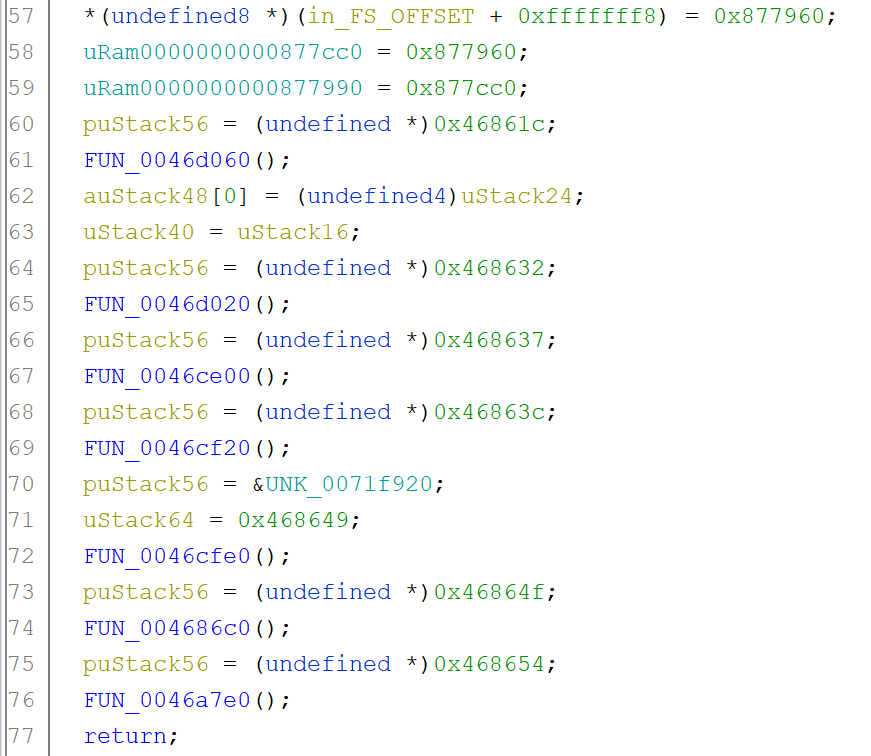

There's so many nested functions in this program. There has to be a better way. Looking at the strings, we see some mangled function names:
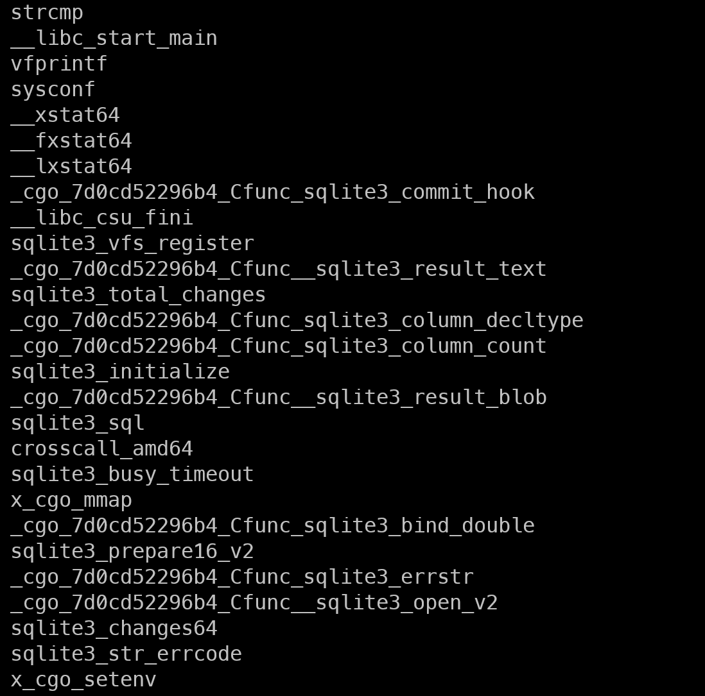

The `_cgo_` part seens to be a common recurrence. Looking this up, it seems to be a way for C code to call back to Go. This indicates that the binary might be written in Go. Go never decompiles nicely, so this is expected. Luckily, there are plugins that helps make the code more readable and adds a ton of symbols/function names back. I personally used this one: https://github.com/mooncat-greenpy/Ghidra_GolangAnalyzerExtension

Here's what the code looks like now:

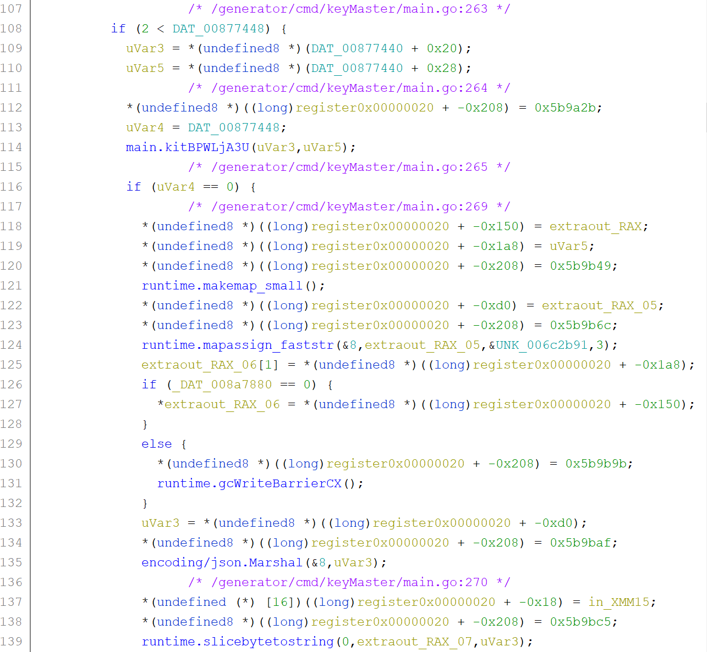

There, much better.

Now that our code looks much cleaner, we can go ahead and start reversing it.

---

Taking a peek at the `main.main` function, there seems to be 3 main branches: `lock`, `unlock`, and `credit`. This can be seen through the hard-coded "strings" that the program checks for:
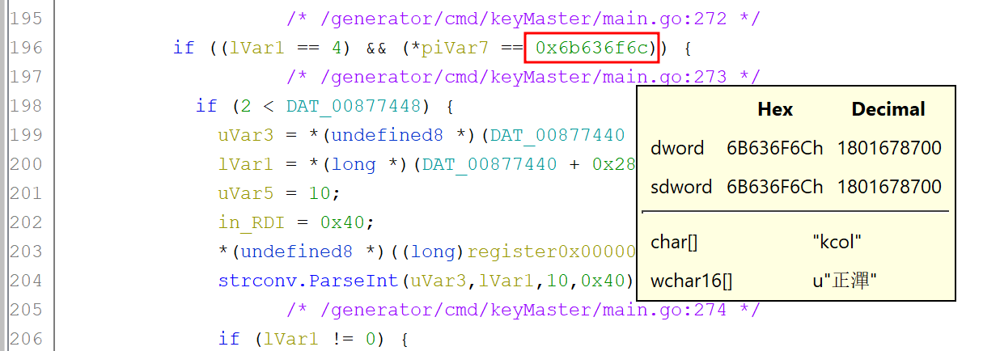
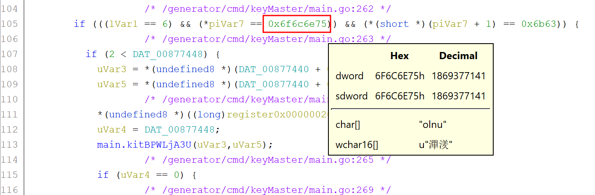
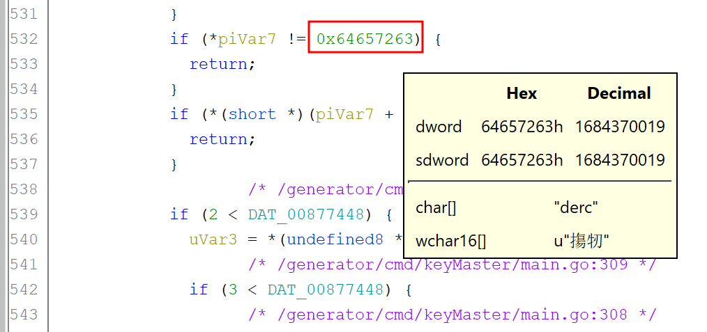


We can confirm this through the different arguments seen in the website's source code when it calls the binary:

```py
def lock():
	if request.args.get('demand') == None:
		return render_template('lock.html')
	else:
		cid = random.randrange(10000, 100000)
		result = subprocess.run(["/opt/keyMaster/keyMaster", 
								 'lock',
								 str(cid),
								 request.args.get('demand'),
								 util.get_username()],
								 capture_output=True, check=True, text=True, cwd="/opt/keyMaster/")
		jsonresult = json.loads(result.stdout)
		if 'error' in jsonresult:
			response = make_response(result.stdout)
			response.mimetype = 'application/json'
			return response
		
		with open("/opt/ransommethis/log/keygeneration.log", 'a') as logfile:
			print(f"{datetime.now().replace(tzinfo=None, microsecond=0).isoformat()}\t{util.get_username()}\t{cid}\t{request.args.get('demand')}", file=logfile)
		return jsonify({'key': jsonresult['plainKey'], 'cid': cid})

def unlock():
	if request.args.get('receipt') == None:
		return render_template('unlock.html')
	else:
		result = subprocess.run(["/opt/keyMaster/keyMaster", 
								 'unlock', 
								 request.args.get('receipt')],
								capture_output=True, check=True, text=True, cwd="/opt/keyMaster/")
		response = make_response(result.stdout)
		response.mimetype = 'application/json'
		return response

def credit():
	args = None	
	if request.method == "GET":
		args = request.args
	elif request.method == "POST":
		args = request.form
	if args.get('receipt') == None or args.get('hackername') == None or args.get('credits') == None:
		# Missing a required argument
		return jsonify({"error": "missing argument"}), 400
	result = subprocess.run(["/opt/keyMaster/keyMaster", 
							'credit',
							args.get('hackername'),
							args.get('credits'),
							args.get('receipt')],
							capture_output=True, check=True, text=True, cwd="/opt/keyMaster")
	response = make_response(result.stdout)
	response.mimetype = 'application/json'
	return response
```

Now that we can identify the different options given, let's figure out which route is the best to take. 

Since our goal is to find the key-encrypting key, we should focus on the encryption and decryption stages, so `lock` and `unlock`.

---

## Unlock branch

Let's take a look at the `unlock` branch. There seems to be one main function within the branch: `main.kitBPWLjA3U`. 

There's a function within that function named `main.t99L4DIIIhE` that grabs an encryption key from a database using `sqlite3`. 

There's also a `main.mTXY69XKhIw` function that seems to be doing some decrypting. Let's take a look:

```c
do {
				/* /generator/cmd/keyMaster/main.go:79 */
puVar3 = (undefined *)register0x00000020;
if (*(undefined **)(ulong *)(unaff_R14 + 0x10) <= register0x00000020 &&
	(undefined *)register0x00000020 != *(undefined **)(ulong *)(unaff_R14 + 0x10)) {
	puVar3 = (undefined *)((long)register0x00000020 + -0x60);
	*(undefined **)((long)register0x00000020 + -8) = unaff_RBP;
	unaff_RBP = (undefined *)((long)register0x00000020 + -8);
				/* /generator/cmd/keyMaster/main.go:86 */
	*(ulong *)((long)register0x00000020 + 0x10) = param_2;
				/* /generator/cmd/keyMaster/main.go:85 */
	*(undefined8 *)((long)register0x00000020 + 8) = param_1;
	*(long *)((long)register0x00000020 + 0x18) = param_3;
				/* /generator/cmd/keyMaster/main.go:80 */
	*(undefined8 *)((long)register0x00000020 + -0x68) = 0x5b860c;
	main.p4hsJ3KeOvw();
				/* /generator/cmd/keyMaster/main.go:81 */
	*(undefined8 *)((long)register0x00000020 + -0x68) = 0x5b8611;
	crypto/aes.NewCipher(extraout_RAX,param_2,param_3);
				/* /generator/cmd/keyMaster/main.go:82 */
	if (param_3 != 0) {
				/* /generator/cmd/keyMaster/main.go:83 */
	return;
	}
				/* /generator/cmd/keyMaster/main.go:85 */
	if (0xf < *(ulong *)((long)register0x00000020 + 0x18)) {
				/* /generator/cmd/keyMaster/main.go:86 */
	if (0xf < *(ulong *)((long)register0x00000020 + 0x10)) {
				/* /generator/cmd/keyMaster/main.go:81 */
		*(ulong *)((long)register0x00000020 + -0x20) = param_2;
		*(undefined8 *)((long)register0x00000020 + -0x10) = extraout_RAX_00;
				/* /generator/cmd/keyMaster/main.go:86 */
		lVar1 = *(ulong *)((long)register0x00000020 + 0x10) - 0x10;
		*(long *)((long)register0x00000020 + -0x28) = lVar1;
				/* /generator/cmd/keyMaster/main.go:87 */
		*(undefined8 *)((long)register0x00000020 + -0x68) = 0x5b865b;
		runtime.makeslice(&DAT_00690c80,lVar1,lVar1);
		*(undefined8 *)((long)register0x00000020 + -0x18) = extraout_RAX_01;
				/* /generator/cmd/keyMaster/main.go:88 */
		*(undefined8 *)((long)register0x00000020 + -0x68) = 0x5b867e;
		crypto/cipher.NewCBCDecrypter
				(*(undefined8 *)((long)register0x00000020 + -0x10),
					*(undefined8 *)((long)register0x00000020 + -0x20),
					*(undefined8 *)((long)register0x00000020 + 8),0x10,
					*(undefined8 *)((long)register0x00000020 + 0x18));
		...
} while( true );
```

Lets take a peek into the `main.p4hsJ3KeOvw` function.
```c
do {
	/* /generator/cmd/keyMaster/main.go:69 */
puVar6 = (undefined *)register0x00000020;
if (*(undefined **)(ulong *)(unaff_R14 + 0x10) <=
	(undefined *)((long)register0x00000020 + -0x10) &&
	(undefined *)((long)register0x00000020 + -0x10) !=
	*(undefined **)(ulong *)(unaff_R14 + 0x10)) {
	puVar6 = (undefined *)((long)register0x00000020 + -0x90);
	*(undefined **)((long)register0x00000020 + -8) = unaff_RBP;
	unaff_RBP = (undefined *)((long)register0x00000020 + -8);
	/* /generator/cmd/keyMaster/main.go:70 */
	uVar5 = 0x2c;
	*(undefined8 *)((long)register0x00000020 + -0x98) = 0x5b849e;
	encoding/base64.(*Encoding).DecodeString
			(DAT_008765d8,
				"hAPv7ZnBM1TOAGVOgY9mVn1swzIlsvJZC0ZM0PwwyFA=insufficient data for c..."
				,0x2c);
	/* /generator/cmd/keyMaster/main.go:71 */
	if (in_RDI != 0) {
	/* /generator/cmd/keyMaster/main.go:72 */
		return;
	}
	/* /generator/cmd/keyMaster/main.go:70 */
	*(char **)((long)register0x00000020 + -0x40) =
		"hAPv7ZnBM1TOAGVOgY9mVn1swzIlsvJZC0ZM0PwwyFA=insufficient data for c..."
	;
	...
	runtime.memmove(*(undefined8 *)((long)register0x00000020 + -0x90),
					*(undefined8 *)((long)register0x00000020 + -0x88),
					*(undefined8 *)((long)register0x00000020 + -0x80));
	/* /generator/cmd/keyMaster/main.go:49 */
	lVar1 = *(long *)((long)register0x00000020 + -0x10);
	lVar2 = *(long *)((long)register0x00000020 + -0x28);
	in_RDI = *(ulong *)((long)register0x00000020 + -0x48);
	lVar3 = *(long *)((long)register0x00000020 + -0x30);
	lVar4 = 0;
	while( true ) {
	/* /generator/cmd/keyMaster/main.go:49 */
	if (lVar3 <= lVar4) {
		/* /generator/cmd/keyMaster/main.go:74 */
		*(undefined8 *)((long)register0x00000020 + -0x98) = 0x5b859d;
		golang.org/x/crypto/pbkdf2.Key
				(lVar1,lVar3,lVar3,*(undefined8 *)((long)register0x00000020 + -0x20),
					*(undefined8 *)((long)register0x00000020 + -0x40),
					*(undefined8 *)((long)register0x00000020 + -0x38),0x1000,0x20,
					&PTR_crypto/sha256.New_006e7a88);
		/* /generator/cmd/keyMaster/main.go:75 */
		return;
	}
...
} while( true );
```

It seems like this function decodes some hardcoded base64 string and passes it into the `golang.org/x/crypto/pbkdf2.Key` function. Looking that up, it seems to take in a password and give us a key of some kind. Lets move on to the rest of the functions.


The general gist of the `main.mTXY69XKhIw` is that we get a constant key, create an AES cipher around it, and then create a CBC Decrypter around that cipher. So that's what the `unlock` branch does.

---

## Lock branch

Now within the `lock` branch, there seems to be 2 subfunctions: `main.DchO32CDDK0` and `main.mtHO6enMvyA`. Here's what `main.DchO32CDDK0` looks like:

```c
do {
				/* /generator/cmd/keyMaster/main.go:182 */
puVar3 = (undefined *)register0x00000020;
if (*(undefined **)(ulong *)(unaff_R14 + 0x10) <=
	(undefined *)((long)register0x00000020 + -0x28) &&
	(undefined *)((long)register0x00000020 + -0x28) !=
	*(undefined **)(ulong *)(unaff_R14 + 0x10)) {
	...
	os.Getenv(&UNK_006c4ae5,0xe);
	*(undefined8 *)((long)register0x00000020 + -0xb0) = 0x5b93dc;
	strconv.Atoi(extraout_RAX,0xe);
	...
	if (true) {
	uVar1 = 0xffffffffffffffff;
	}
	*(undefined8 *)((long)register0x00000020 + -0xb0) = 0x5b93ef;
	github.com/google/uuid.SetClockSequence(uVar1);
				/* /generator/cmd/keyMaster/main.go:188 */
	*(undefined8 *)((long)register0x00000020 + -0xb0) = 0x5b93f4;
	github.com/google/uuid.NewUUID
			(*(undefined8 *)((long)register0x00000020 + -0xa8),
				*(undefined8 *)((long)register0x00000020 + -0xa0));
	...
	github.com/google/uuid.encodeHex
			((undefined *)((long)register0x00000020 + -0x2c),0x24,0x24,in_RDI,in_RSI);
				/* /go/pkg/mod/github.com/google/uuid@v1.3.0/uuid.go:188 */
	puVar2 = (undefined *)((long)register0x00000020 + -0x2c);
	*(undefined8 *)((long)register0x00000020 + -0xb0) = 0x5b945d;
	runtime.slicebytetostring((undefined *)((long)register0x00000020 + -0x4c),puVar2,0x24);
				/* /generator/cmd/keyMaster/main.go:192 */
	*(undefined8 *)((long)register0x00000020 + -0xb0) = 0x5b946a;
	runtime.stringtoslicebyte(0,extraout_RAX_02,puVar2);
	if ((undefined *)0x1f < puVar2) {
				/* /generator/cmd/keyMaster/main.go:196 */
	return;
	}
				/* /generator/cmd/keyMaster/main.go:192 */
	*(undefined8 *)((long)register0x00000020 + -0xb0) = 0x5b94b3;
	runtime.panicSliceAcap
			(*(undefined8 *)((long)register0x00000020 + -0xa8),
				*(undefined8 *)((long)register0x00000020 + -0xa0));
}
				/* /generator/cmd/keyMaster/main.go:182 */
*(undefined8 *)(puVar3 + -8) = 0x5b94b9;
runtime.morestack_noctxt();
register0x00000020 = (BADSPACEBASE *)puVar3;
} while( true );
```

It seems as if it sets the time to the current time, generates a UUID based on the current time, encodes it into hex. Nothing major seen yet. Let's look at the other function `main.mtHO6enMvyA`:

```c
undefined8 extraout_RAX;
long unaff_R14;
undefined8 uStack0000000000000008;
undefined8 uStack0000000000000010;
undefined8 uStack0000000000000018;
undefined local_20 [24];

uStack0000000000000008 = param_1;
uStack0000000000000018 = param_3;
uStack0000000000000010 = param_2;
				/* /generator/cmd/keyMaster/main.go:94 */
while (local_20 < *(undefined **)(ulong *)(unaff_R14 + 0x10) ||
		local_20 == *(undefined **)(ulong *)(unaff_R14 + 0x10)) {
				/* /generator/cmd/keyMaster/main.go:94 */
runtime.morestack_noctxt();
}
				/* /generator/cmd/keyMaster/main.go:95 */
runtime.makeslice(&DAT_00690c80,0x10,0x10);
				/* /generator/cmd/keyMaster/main.go:96 */
crypto/rand.Read(extraout_RAX,0x10,0x10);
				/* /generator/cmd/keyMaster/main.go:97 */
				/* /generator/cmd/keyMaster/main.go:98 */
return;
```

That's it? It just grabs some random values? That can't be right. Looking at the assembly, it seems as if there's more to this function than the disassembly shows:

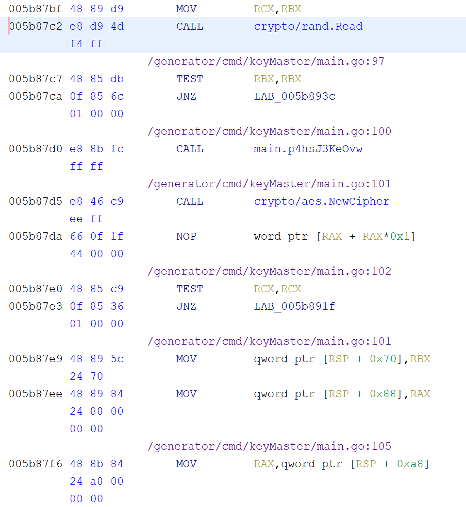

It seems as if Ghidra thinks the function is done before it actually is. We can manually unset this by going to Edit->Tool Options->Decompiler->Analysis and then unchecking the "Eliminate unreachable code" box:

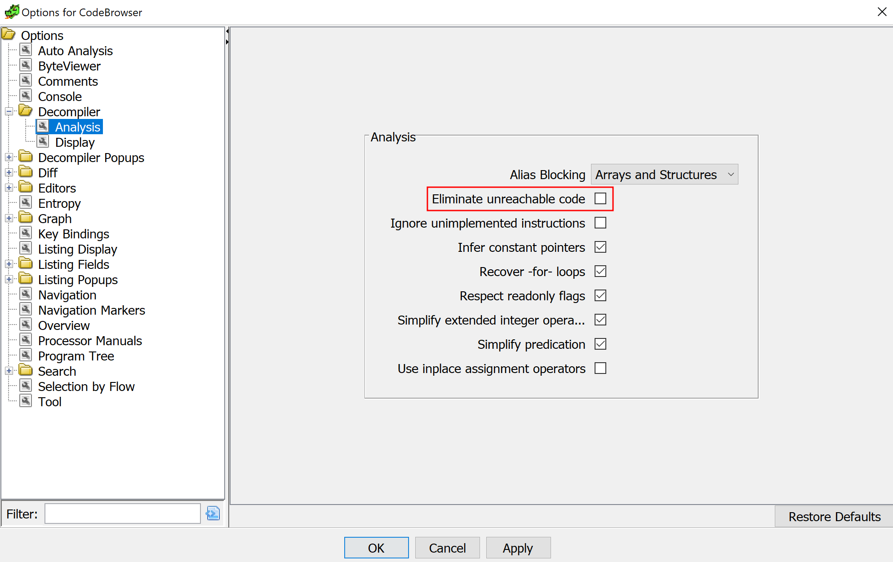

Now we see so much more in the disassembly:

```c
lVar2 = 0x10;
local_10 = extraout_RAX;
crypto/rand.Read(extraout_RAX,0x10,0x10);
	/* /generator/cmd/keyMaster/main.go:97 */
if (true) {
	/* /generator/cmd/keyMaster/main.go:98 */
	return;
}
	/* /generator/cmd/keyMaster/main.go:100 */
main.p4hsJ3KeOvw();
	/* /generator/cmd/keyMaster/main.go:101 */
crypto/aes.NewCipher(extraout_RAX_00,0x10,lVar2);
...
	/* /generator/cmd/keyMaster/main.go:105 */
main.oJBq2ENUTYQ(uStack0000000000000008,lStack0000000000000010,uStack0000000000000018,0x10);
	/* /generator/cmd/keyMaster/main.go:106 */
crypto/cipher.NewCBCEncrypter(local_18,0x10,local_10,0x10,0x10);
	/* /generator/cmd/keyMaster/main.go:108 */
	/* /generator/cmd/keyMaster/main.go:107 */
runtime.makeslice(&DAT_00690c80,lVar1,lVar1);
	/* /generator/cmd/keyMaster/main.go:108 */
(**(code **)(extraout_RAX_03 + 0x20))
		(lVar1,extraout_RAX_02,*(code **)(extraout_RAX_03 + 0x20),lVar1,lVar1,uVar3);
	/* /generator/cmd/keyMaster/main.go:109 */
if (0x10 < lVar1 + 0x10U) {
	runtime.growslice(&DAT_00690c80,local_10,0x10,0x10,lVar1 + 0x10U);
}
runtime.memmove(in_stack_ffffffffffffff60,in_stack_ffffffffffffff68,in_stack_ffffffffffffff70);
return;
```

So this function *really* gets 16 random bytes, grabs the constant key (as we concluded earlier), creates a new AES cipher, does some other function and creates a new CBC Encrypter. I looked at the `main.oJBq2ENUTYQ` and didn't truly understand it. We have a decent idea of what is going on now. Let's give dynamic analysis a shot.

---

## Dynamic Analysis

Before we delve in to the program, we also need to make sure our GDB addresses match up to the Ghidra addresses so we can break at the right places. We can run `p _start` in GEF to show the address of it and compare it to the address in Ghidra. Then, change Ghidra's base address so that the `_start` addresses match. I believe the `00400000` base address works. Now that we can break at functions, we should try to find out what key is used to encrypt the keys.

Now that we've dealt with that, we can move on to the logic part. To get the key used to *encrypt* the keys themselves, we can look inside of the `main.p4hsJ3KeOvw` function. More specifically, we can look at the results of the `golang.org/x/crypto/pbkdf2.Key` function call within that function to see what that constant key is. Since it's the key being used to encrypt in the `lock` branch and decrypt in the `unlock` branch, it *must* be the key-encrypting key!

In Ghidra, the address of the `golang.org/x/crypto/pbkdf2.Key` call is `0x005b8598`, so we can break there, finish the instruction, and look at the result.

From the website's source code, we can look at one of the calls they made to the binary and copy that to ensure we use valid values. I will be using the command `gdb --args ./keyMaster lock 12345 1.23 lmao`. To set the breakpoint, you can type `b *0x005b8598` and then `r` to run it. `ni` will finish the instruction. Then, we are met with this:

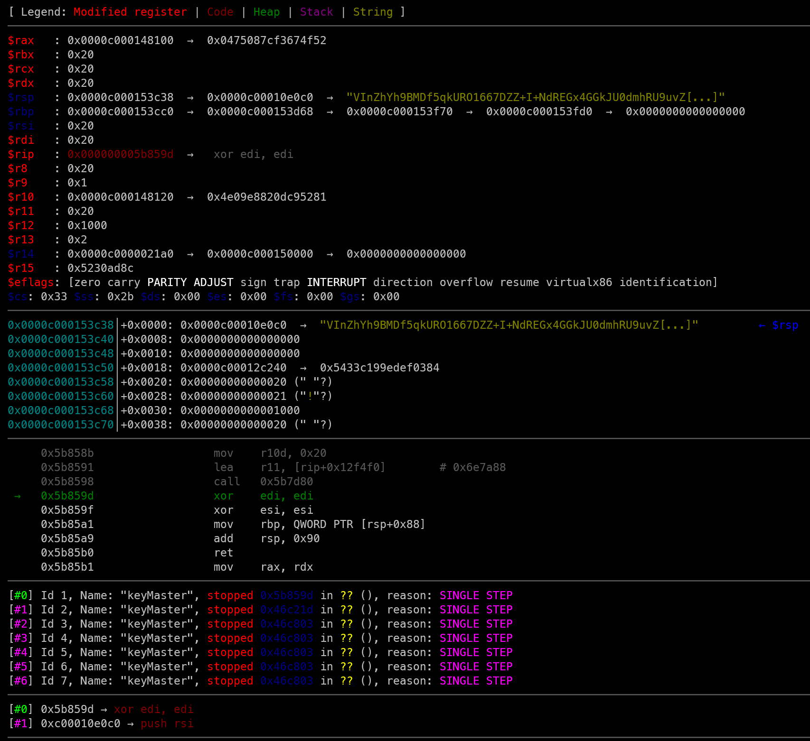

The typical place return values are stored is in `rax`. If we look at that value in memory, we can see the bytes there:

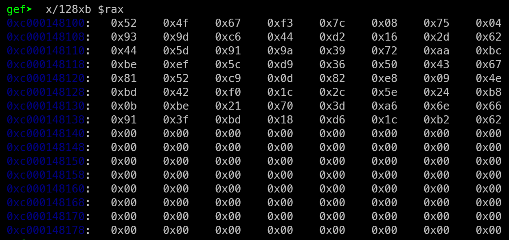

If we look back at the `pbkdf2.Key` function call in Ghidra, we can see that the value `0x20` is passed into the function. Also, that value is the same as numerous registers in memory. That hints at the idea that the length of the key is also of length `0x20`, or `32`. With that, we get our key-encrypting key:

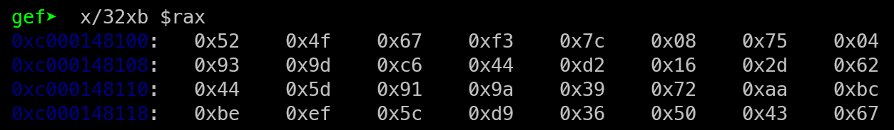

The key's value is `0x524f67f37c087504939dc644d2162d62445d919a3972aabcbeef5cd936504367`, which is `Uk9n83wIdQSTncZE0hYtYkRdkZo5cqq8vu9c2TZQQ2c=` when base64 encoded, which is the flag!

Flag: `Uk9n83wIdQSTncZE0hYtYkRdkZo5cqq8vu9c2TZQQ2c=`
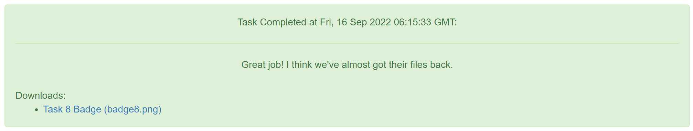