# Task 9

Prompt:
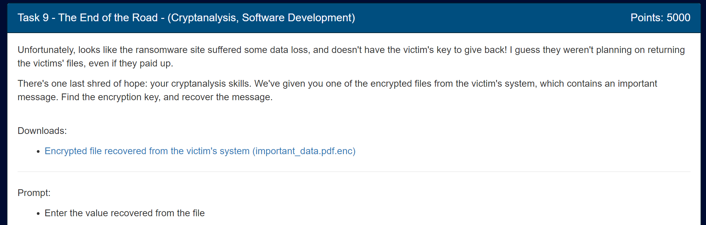

Files:

- [Encrypted file recovered from the victim's system (important_data.pdf.enc)](../orig_files/9/important_data.pdf.enc)

Alright, we're on the last task! Now we just have to decrypt our file... without the key... amazing.

We have the `keyMaster.db` database from task 8, so we can see what some of the keys look like and even decrypt them ourselves since we now have the key-encrypting key:

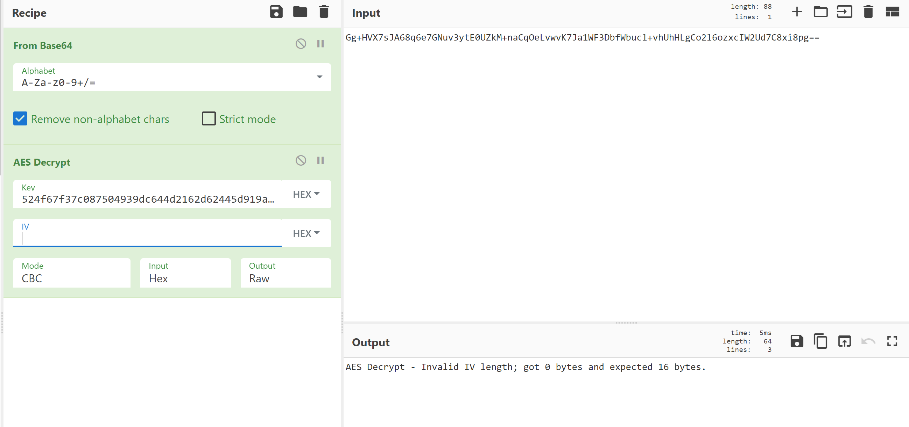

I forgot there was an IV. I spent a ridiculously long time trying to figure out what this value was. I put in zeroes as the IV just to see what would happen as it wouldn't affect the values passing through it since `something XOR 0 = something` and saw this:

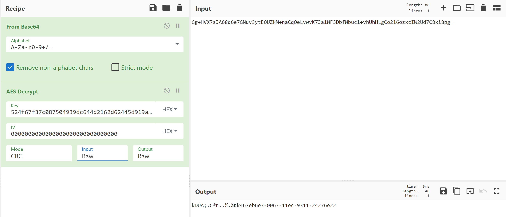

Okay, so it looks like we get some garbage and then something resembling a UUID. Very interesting. If you remember from task 8, we saw something like this in the `lock` branch:
```c
do {
				/* /generator/cmd/keyMaster/main.go:182 */
puVar3 = (undefined *)register0x00000020;
if (*(undefined **)(ulong *)(unaff_R14 + 0x10) <=
	(undefined *)((long)register0x00000020 + -0x28) &&
	(undefined *)((long)register0x00000020 + -0x28) !=
	*(undefined **)(ulong *)(unaff_R14 + 0x10)) {
	...
	os.Getenv(&UNK_006c4ae5,0xe);
	*(undefined8 *)((long)register0x00000020 + -0xb0) = 0x5b93dc;
	strconv.Atoi(extraout_RAX,0xe);
	...
	if (true) {
	uVar1 = 0xffffffffffffffff;
	}
	*(undefined8 *)((long)register0x00000020 + -0xb0) = 0x5b93ef;
	github.com/google/uuid.SetClockSequence(uVar1);
				/* /generator/cmd/keyMaster/main.go:188 */
	*(undefined8 *)((long)register0x00000020 + -0xb0) = 0x5b93f4;
	github.com/google/uuid.NewUUID
			(*(undefined8 *)((long)register0x00000020 + -0xa8),
				*(undefined8 *)((long)register0x00000020 + -0xa0));
	...
	github.com/google/uuid.encodeHex
			((undefined *)((long)register0x00000020 + -0x2c),0x24,0x24,in_RDI,in_RSI);
				/* /go/pkg/mod/github.com/google/uuid@v1.3.0/uuid.go:188 */
	puVar2 = (undefined *)((long)register0x00000020 + -0x2c);
	*(undefined8 *)((long)register0x00000020 + -0xb0) = 0x5b945d;
	runtime.slicebytetostring((undefined *)((long)register0x00000020 + -0x4c),puVar2,0x24);
				/* /generator/cmd/keyMaster/main.go:192 */
	*(undefined8 *)((long)register0x00000020 + -0xb0) = 0x5b946a;
	runtime.stringtoslicebyte(0,extraout_RAX_02,puVar2);
	if ((undefined *)0x1f < puVar2) {
				/* /generator/cmd/keyMaster/main.go:196 */
	return;
	}
				/* /generator/cmd/keyMaster/main.go:192 */
	*(undefined8 *)((long)register0x00000020 + -0xb0) = 0x5b94b3;
	runtime.panicSliceAcap
			(*(undefined8 *)((long)register0x00000020 + -0xa8),
				*(undefined8 *)((long)register0x00000020 + -0xa0));
}
				/* /generator/cmd/keyMaster/main.go:182 */
*(undefined8 *)(puVar3 + -8) = 0x5b94b9;
runtime.morestack_noctxt();
register0x00000020 = (BADSPACEBASE *)puVar3;
} while( true );
```
and it was followed by this:

```c
lVar2 = 0x10;
local_10 = extraout_RAX;
crypto/rand.Read(extraout_RAX,0x10,0x10);
				/* /generator/cmd/keyMaster/main.go:97 */
if (true) {
				/* /generator/cmd/keyMaster/main.go:98 */
return;
}
				/* /generator/cmd/keyMaster/main.go:100 */
main.p4hsJ3KeOvw();
				/* /generator/cmd/keyMaster/main.go:101 */
crypto/aes.NewCipher(extraout_RAX_00,0x10,lVar2);
...
				/* /generator/cmd/keyMaster/main.go:105 */
main.oJBq2ENUTYQ(uStack0000000000000008,lStack0000000000000010,uStack0000000000000018,0x10);
				/* /generator/cmd/keyMaster/main.go:106 */
crypto/cipher.NewCBCEncrypter(local_18,0x10,local_10,0x10,0x10);
				/* /generator/cmd/keyMaster/main.go:108 */
				/* /generator/cmd/keyMaster/main.go:107 */
runtime.makeslice(&DAT_00690c80,lVar1,lVar1);
				/* /generator/cmd/keyMaster/main.go:108 */
(**(code **)(extraout_RAX_03 + 0x20))
		(lVar1,extraout_RAX_02,*(code **)(extraout_RAX_03 + 0x20),lVar1,lVar1,uVar3);
				/* /generator/cmd/keyMaster/main.go:109 */
if (0x10 < lVar1 + 0x10U) {
runtime.growslice(&DAT_00690c80,local_10,0x10,0x10,lVar1 + 0x10U);
}
runtime.memmove(in_stack_ffffffffffffff60,in_stack_ffffffffffffff68,in_stack_ffffffffffffff70);
return;
```

We get a UUID value based on the time, read in some random bytes, grab the key-encrypting key, and create an AES CBC cipher with all of this. This seems oddly similar to that. That random garbage we see at the start must be the random bytes from the `crypto/rand.Read` function call. Since we have the key and the encrypted value already, it only makes sense for that to be the IV. If we try to do this in CyberChef, we see this:

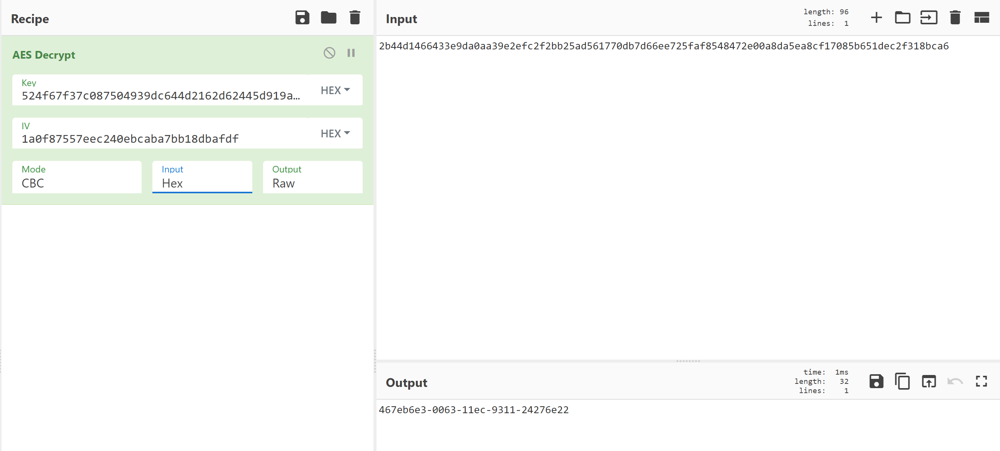

We get a UUID value! Perfect! We can try to check what time it was generated at (I used https://www.uuidtools.com/decode for this):

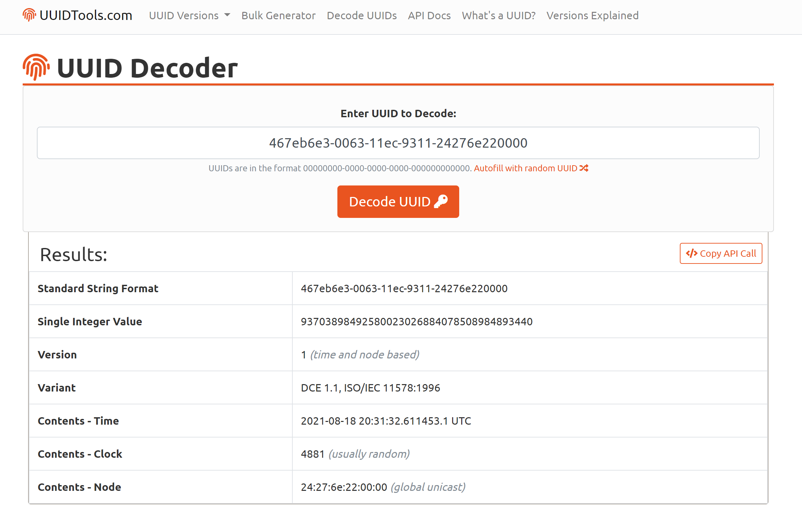

I had to add 4 trailing zeroes to match the format. From this, we learn that the UUID is of version 1 and that the UUID was generated at 8/18/21 at 20:31:32 UTC, which roughly matches what we see in `keyMaster.db`:

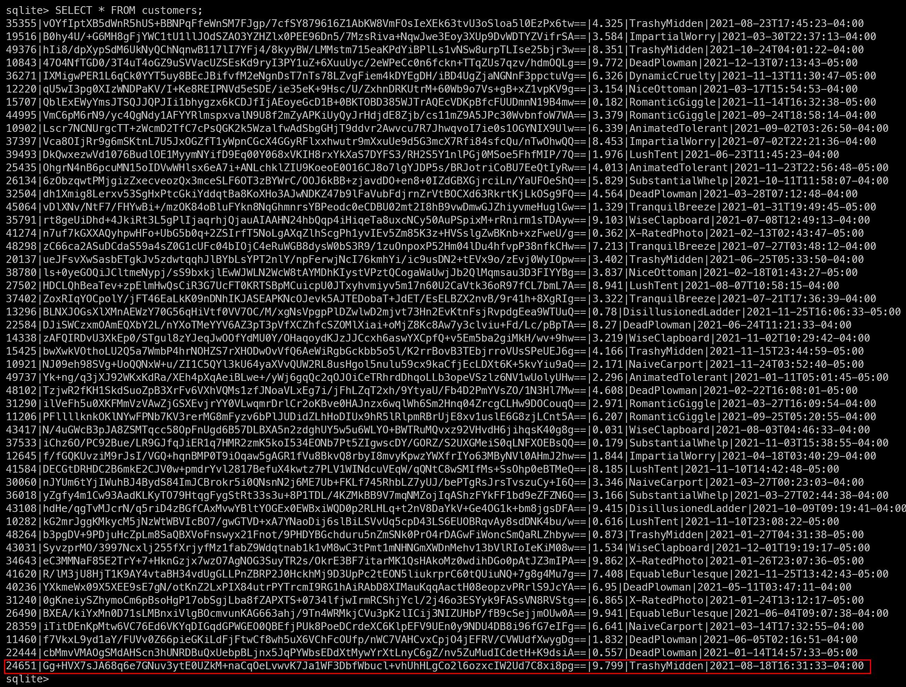

Now that we know how the key is generated, we can start focusing on how to derive the correct key.

---

Since the key is equal to the UUIDv1 value of the time it was generated, we just need to figure out what time the key was generated. Unfortunately, the database doesn't have our key in there. Looks like we need to find another way.

The admin panel had a `keygeneration.log` file that showed all of the keys generated and their generation times! Here's what that looks like:

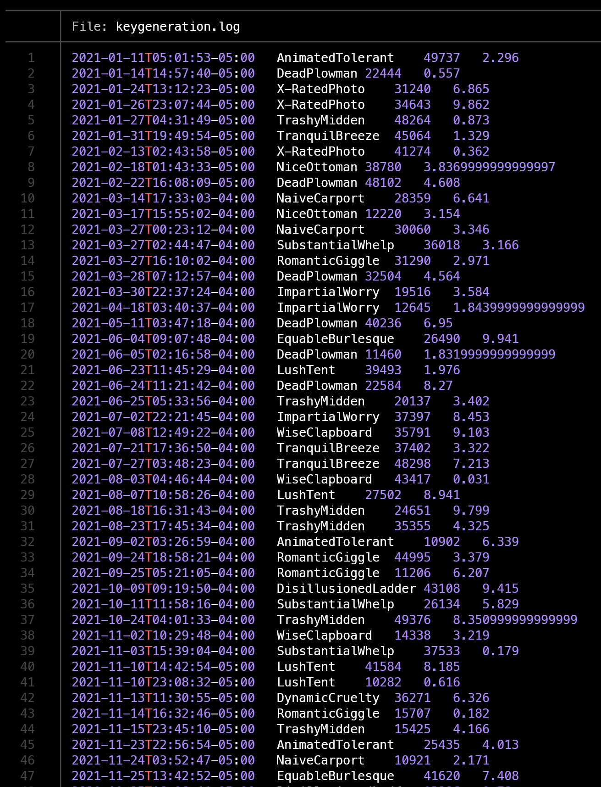

There's a ton of entries here. Lets look for the test key we decrypted. We know the `cid` (or `customerId`) is `24651`, so we can look specifically for that:

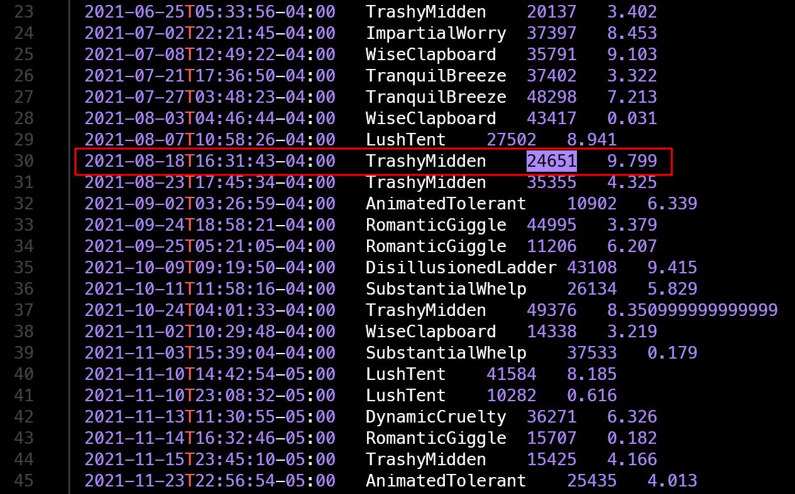

So the `keygeneration.log` file shows a timestamp of 8/18/21 20:31:43 UTC and the actual key had a timestamp of 8/18/21 20:31:32 UTC. That's a time difference of 9 seconds. We can work with that! If we check the `keygeneration.log` file for our `cid` of `80359` (got this value from task a2's demand `cid` parameter), we can see our key's entry:

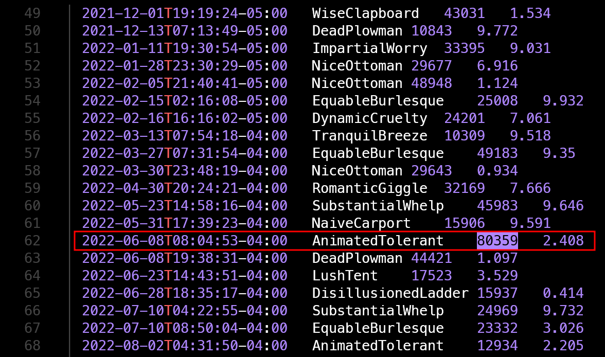

Alright, so our key was logged to have been generated at 6/8/22 12:04:53 UTC. If we take the time difference into account, the key should have roughly been created at 6/8/22 12:04:44 UTC. I hand brute forced this value and got `00000000-e723-11ec-af6f-0800200c9a66`. This value is equivalent to 6/8/22 12:03:25 UTC. I decided to brute force the lower 4 bytes until one of the keys worked since that was a reasonably small searchspace.

---

## Decryption

Now for the big question: How do we actually decrypt the file?

If you recall from task A2, we were told that the attackers had downloaded tools onto the system to encrypt the files. Lets take a look back at those.

We have 3 files: `busybox`, `openssl`, and `ransom.sh`. I believe `busybox` and `openssl` are quite self explanatory. Let's take a look at `ransom.sh`:

```bash
#!/bin/sh
read -p "Enter encryption key: " key
hexkey=`echo -n $key | ./busybox xxd -p | ./busybox head -c 32`
export hexkey
./busybox find $1 -regex '.*\.\(pdf\|doc\|docx\|xls\|xlsx\|ppt\|pptx\)' -print -exec sh -c 'iv=`./openssl rand -hex 16`; echo -n $iv > $0.enc; ./openssl enc -e -aes-128-cbc -K $hexkey -iv $iv -in $0 >> $0.enc; rm $0' \{\} \; 2>/dev/null
```

Alright, this is how the file is being encrypted. We enter in the encryption key, which is the UUID of the key's generation time, convert it to hex, and take the first 32 bytes. That value is then used as the key in an AES-128-CBC encryption scheme with 16 random hex bytes used as the IV. Luckily, it seems like that IV is prepended to the encrypted files. We can check this by looking at our encrypted document via `xxd important_data.pdf.enc | less`:

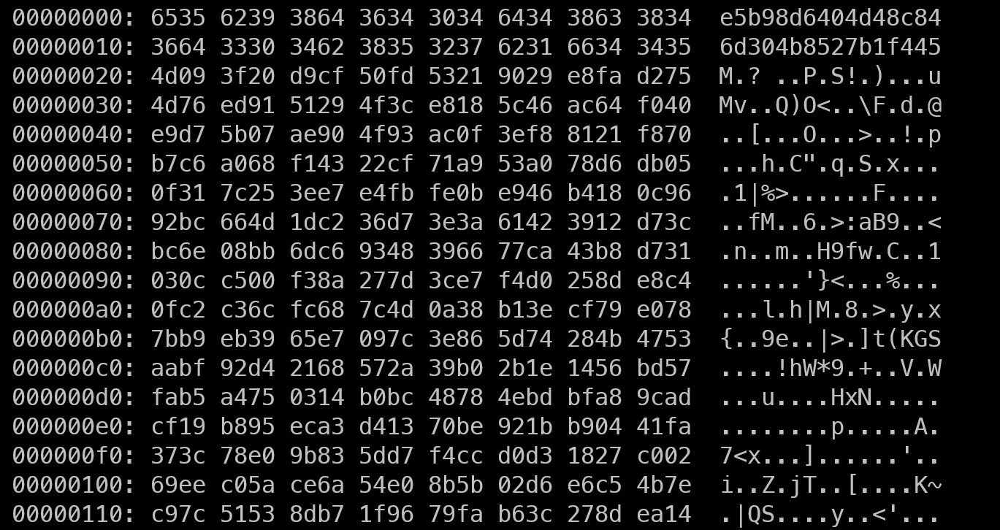

Awesome! We now have the encryption method (AES-128-CBC) and the IV (`e5b98d6404d48c846d304b8527b1f445`).

From the `ransom.sh` script, we know that the key is the first 32 bytes of the UUID. If we run the exact line of code used to generate `hexkey`, we can confirm the first 16 characters are what bytes the decryption actually uses:
```
echo -n "00000000-e723-11ec-af6f-0800200c9a66" | xxd -p | head -c 32
30303030303030302d653732332d3131
```

This tells us that `00000000-e723-11` is the only portion looked at when decrypting.

We also know that if the file was to be successfully decrypted, the file would be a PDF. We can check for a correct decryption within our brute forcer by looking for the PDF magic bytes. Since AES is a block cipher, we can get away with just decrypting the first block (instead of decrypting the entire file) and checking for the valid magic bytes. This way, we save time and make our code run faster.

---

## Brute force!!! :D

Now we can get into the code! 

Disclaimer: I know this is terrible. I've never coded in rust before and tried to give it a solid effort :)

I wrote it in rust because of peer pressure lmao. I iterated over all the possible values of the lower 4 bytes of the timestamp, decrypted the first block with the current key and IV, manually XOR'd with the IV since this AES crate didn't do that final part of the decryption, and then compared the start of the decrypted block with the PDF's magic bytes. If they matched, the code would output the key for us to manually check.

```rs
use aes::Aes128;
use aes::cipher::{BlockDecrypt, KeyInit, generic_array::GenericArray};
use std::fs::File;
use hex_literal::hex;
use std::io;
use std::io::Read;
use std::str;

use indicatif::ProgressBar;

fn main() -> io::Result<()> {
    let h: [u8; 16] = *b"0123456789abcdef";
    let goal_arr: [u8; 4] = [37, 80, 68, 70];

    let mut key: [u8; 16] = *b"00000000-e723-11";
    let iv = hex!("e5b98d6404d48c846d304b8527b1f445");

    let mut key_arr = GenericArray::from([0u8; 16]);
    let mut block_copy = GenericArray::from([0u8; 16]);

    let mut f = File::open("/home/rohanvis24/cbc22_task9/important_data_modded.pdf.enc")?;
    let mut block = [0u8; 16];
    f.read_exact(&mut block)?;

    let duration: u64 = 256*256*256*256;
    let bar = ProgressBar::new(duration);
    for _i in 0..duration {
        key[7] = key[7] + 1;
        if key[7] == h[15] + 1 {
            key[7] = h[0];
            key[6] = key[6] + 1;
            if key[6] == h[15] + 1 {
                key[6] = h[0];
                key[5] = key[5] + 1;
                if key[5] == h[15] + 1 {
                    key[5] = h[0];
                    key[4] = key[4] + 1;
                    if key[4] == h[15] + 1 {
                        key[4] = h[0];
                        key[3] = key[3] + 1;
                        if key[3] == h[15] + 1 {
                            key[3] = h[0];
                            key[2] = key[2] + 1;
                            if key[2] == h[15] + 1 {
                                key[2] = h[0];
                                key[1] = key[1] + 1;
                                if key[1] == h[15] + 1 {
                                    key[1] = h[0];
                                    key[0] = key[0] + 1;
                                    if key[0] == h[15] + 1 {
                                        println!("Exhausted all keys");
                                        break;
                                    }
                                    if key[0] == h[9] + 1 {
                                        key[0] = h[10];
                                    }
                                }
                                if key[1] == h[9] + 1 {
                                    key[1] = h[10];
                                }
                            }
                            if key[2] == h[9] + 1 {
                                key[2] = h[10];
                            }
                        }
                        if key[3] == h[9] + 1 {
                            key[3] = h[10];
                        }
                    }
                    if key[4] == h[9] + 1 {
                        key[4] = h[10];
                    }
                }
                if key[5] == h[9] + 1 {
                    key[5] = h[10];
                }
            }
            if key[6] == h[9] + 1 {
                key[6] = h[10];
            }
        }
        if key[7] == h[9] + 1 {
            key[7] = h[10];
        }

        //progress bar update
        bar.inc(1);

        //decryption
        for i in 0..16 {
            block_copy[i] = block[i];
            key_arr[i] = key[i];
        }

        let cipher = Aes128::new(&key_arr);
        cipher.decrypt_block(&mut block_copy);

        for a in 0..16 {
            block_copy[a] = block_copy[a] ^ iv[a];
        }

        if &block_copy[0..4] == goal_arr {
            println!("=======================================================================================================================");
            println!("FOUND KEY: {:?}", &key);
            println!("Ascii: {:?}", str::from_utf8(&key).unwrap());
            println!("=======================================================================================================================");
        }
    }
    bar.finish();
    Ok(())
}
```

Note: I realized afterwards thanks to other fellow competitors and general hindsight that the code could've been made faster by XORing the PDF magic bytes and the constant IV before the loop and compare the decrypted block to that, eliminating a loop within the bigger loop. There were many optimizations that I missed (I was originally only running my code in debug mode and not release mode, which was a major L lmao), but the code does the job :D

When we run it, the first key pops in roughly 90 seconds:

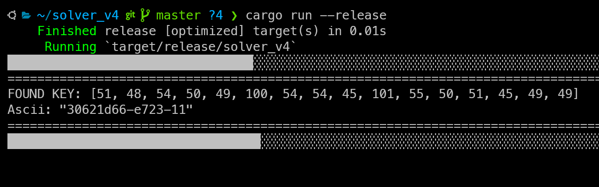

So our candidate is `30621d66-e723-11`. Let's try to decrypt the file through CyberChef.

I made a modified encrypted file with the IV removed from the top to only decrypt the file contents. Here's how the decryption turned out:


That looks like good data to me! We can download that output and read the PDF:

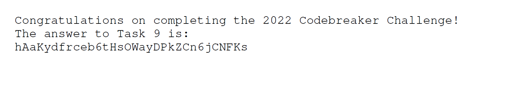

And with that, we have successfully decrypted the file! We can submit our flag and finally relax :)

Flag: `hAaKydfrceb6tHsOWayDPkZCn6jCNFKs`
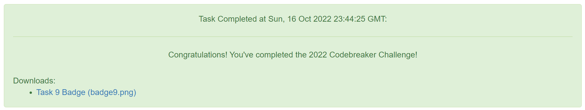